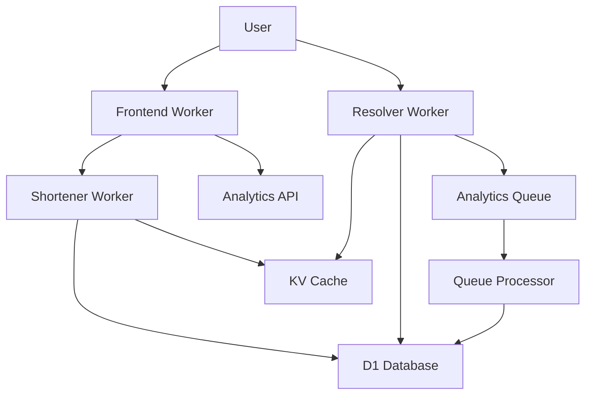

# Design Document

## Overview

This design document outlines the implementation approach for completing the URL shortener application. The system follows a microservices architecture using Cloudflare Workers, with each service having a specific responsibility. The design emphasizes performance through intelligent caching, reliability through graceful error handling, and scalability through asynchronous processing.

## Architecture

### System Components



### Data Flow

1. **URL Shortening Flow:**
   - User submits URL via Frontend
   - Frontend calls Shortener Worker API
   - Shortener generates unique code, stores in D1, caches in KV
   - Returns short URL to user

2. **URL Resolution Flow:**
   - User clicks short URL
   - Resolver checks KV cache first
   - If miss, queries D1 and updates KV
   - Sends analytics event to queue
   - Redirects user to destination

3. **Analytics Processing Flow:**
   - Analytics events queued during resolution
   - Queue Processor batches and processes events
   - Enriched data stored in analytics table

## Components and Interfaces

### 1. Shortener Worker

**Purpose:** Handle URL shortening requests and provide CRUD operations for links.

**API Endpoints:**
```typescript
POST /shorten
  Body: { url: string, customCode?: string, expiresAt?: string }
  Response: { shortCode: string, shortUrl: string, originalUrl: string }

GET /links
  Query: { limit?: number, offset?: number }
  Response: { links: Link[], total: number }

GET /links/:shortCode
  Response: Link

DELETE /links/:shortCode
  Response: { success: boolean }
```

**Core Functions:**
- `generateShortCode()`: Creates unique 6-8 character codes
- `validateUrl()`: Ensures URL is valid and accessible
- `storeLink()`: Saves to D1 and caches in KV
- `checkCodeAvailability()`: Prevents collisions

### 2. Enhanced Resolver Worker

**Current State:** Basic KV→D1 fallback implemented
**Enhancements Needed:**
- Complete analytics table insertion
- Better error handling
- Cache warming strategies

**Key Improvements:**
```typescript
// Enhanced analytics processing
const processAnalytics = async (req: Request, shortCode: string) => {
  const analyticsData: AnalyticsData = {
    shortCode,
    timestamp: new Date().toISOString(),
    // ... existing fields
  };
  
  // Fire-and-forget queue send
  ctx.waitUntil(env.shortener_analytics.send(analyticsData));
};
```

### 3. Queue Processor Worker

**Current State:** Stub implementation with TODO comments
**Implementation Needed:**
- Batch processing of analytics events
- Analytics Engine data point creation
- Error handling and retry logic

**Core Logic:**
```typescript
async queue(batch: MessageBatch<AnalyticsData>, env: Env): Promise<void> {
  const dataPoints = batch.messages.map(msg => ({
    blobs: [msg.body.shortCode, msg.body.country, msg.body.userAgent],
    doubles: [msg.body.botScore || 0],
    indexes: [msg.body.shortCode]
  }));
  
  await env.ANALYTICS_ENGINE.writeDataPoints(dataPoints);
}
```

### 4. Frontend Integration

**Current State:** Static UI with auth modal
**Enhancements Needed:**
- URL shortening form functionality
- Link management dashboard
- Analytics visualization

**New Components:**
- `UrlShortenerForm.vue`: Main shortening interface
- `LinksList.vue`: User's link history
- `AnalyticsDashboard.vue`: Click statistics

## Data Models

### Analytics Engine Data Points

Analytics data will be stored using Cloudflare Analytics Engine, which doesn't require schema management:

```typescript
interface AnalyticsDataPoint {
  // String data (up to 8 blobs)
  blobs: [
    string, // shortCode
    string, // country
    string, // userAgent
    string, // referer
    string, // city
    string, // continent
    string, // httpProtocol
    string  // language
  ];
  
  // Numeric data (up to 8 doubles)  
  doubles: [
    number, // botScore
    number, // asn
    number, // isBot (0 or 1)
    number, // timestamp (unix)
  ];
  
  // Indexed fields for efficient querying
  indexes: [string]; // shortCode for filtering
}
```

### Analytics Engine Benefits

- **No Schema Management:** Automatic handling of data structure
- **Time-Series Optimized:** Built for analytics workloads
- **Automatic Aggregation:** Built-in functions for common queries
- **Scalable:** Handles high-volume analytics data efficiently

### Short Code Generation Strategy

**Algorithm:** Base62 encoding with collision detection
**Length:** 6-8 characters (62^6 = 56B possibilities)
**Pattern:** `[a-zA-Z0-9]`

```typescript
const generateShortCode = (length: number = 6): string => {
  const chars = 'abcdefghijklmnopqrstuvwxyzABCDEFGHIJKLMNOPQRSTUVWXYZ0123456789';
  let result = '';
  for (let i = 0; i < length; i++) {
    result += chars.charAt(Math.floor(Math.random() * chars.length));
  }
  return result;
};
```

## Error Handling

### Graceful Degradation Strategy

1. **KV Unavailable:** Direct D1 queries with performance impact
2. **D1 Unavailable:** Return 503 with retry-after header
3. **Queue Unavailable:** Log error, continue with redirect
4. **Analytics Processing Failure:** Retry with exponential backoff

### Error Response Format

```typescript
interface ErrorResponse {
  error: {
    code: string;
    message: string;
    details?: any;
  };
  timestamp: string;
  requestId: string;
}
```

### Retry Logic

```typescript
const retryWithBackoff = async (fn: () => Promise<any>, maxRetries: number = 3) => {
  for (let i = 0; i < maxRetries; i++) {
    try {
      return await fn();
    } catch (error) {
      if (i === maxRetries - 1) throw error;
      await new Promise(resolve => setTimeout(resolve, Math.pow(2, i) * 1000));
    }
  }
};
```

## Testing Strategy

### Unit Testing

**Shortener Worker:**
- URL validation logic
- Short code generation and collision handling
- Database operations

**Queue Processor:**
- Analytics data processing
- Batch operations
- Error handling and retries

**Frontend Components:**
- Form validation
- API integration
- User interactions

### Integration Testing

**End-to-End Flows:**
- Complete URL shortening workflow
- Resolution and analytics tracking
- Error scenarios and recovery

**Performance Testing:**
- Cache hit/miss ratios
- Response time under load
- Queue processing latency

### Testing Tools

- **Vitest:** Unit testing framework
- **Wrangler:** Local development and testing
- **Playwright:** E2E testing for frontend

## Performance Optimizations

### Caching Strategy

1. **KV Cache TTL:** 24 hours for active links, 1 hour for new links
2. **Cache Warming:** Pre-populate KV when links are created
3. **Cache Invalidation:** Remove from KV when links are deleted

### Database Optimizations

1. **Prepared Statements:** Reuse compiled queries
2. **Batch Operations:** Group multiple analytics inserts
3. **Index Strategy:** Optimize for common query patterns

### Queue Processing

1. **Batch Size:** Process 10-50 messages per invocation
2. **Parallel Processing:** Handle multiple batches concurrently
3. **Dead Letter Queue:** Handle permanently failed messages

## Security Considerations

### Input Validation

```typescript
const validateUrl = (url: string): boolean => {
  try {
    const parsed = new URL(url);
    return ['http:', 'https:'].includes(parsed.protocol);
  } catch {
    return false;
  }
};
```

### Rate Limiting

- Implement per-IP rate limiting in shortener worker
- Use KV to track request counts
- Return 429 status for exceeded limits

### Data Privacy

- Hash IP addresses before storage
- Implement data retention policies
- Sanitize user agent and referrer data

## Deployment Strategy

### Environment Configuration

**Development:**
- Local wrangler dev servers
- Shared development database
- Debug logging enabled

**Production:**
- Smart placement for optimal performance
- Production database with backups
- Monitoring and alerting enabled

### Migration Plan

1. **Phase 1:** Complete shortener worker implementation
2. **Phase 2:** Enhance queue processor and analytics
3. **Phase 3:** Frontend integration and testing
4. **Phase 4:** Performance optimization and monitoring

## Monitoring and Observability

### Key Metrics

- **Performance:** Response times, cache hit rates
- **Reliability:** Error rates, queue processing lag
- **Usage:** Links created, clicks processed, popular domains

### Alerting Thresholds

- Cache hit ratio < 80%
- Queue processing lag > 5 minutes
- Error rate > 1%
- Response time P99 > 100ms

### Logging Strategy

```typescript
const logEvent = (level: string, message: string, metadata?: any) => {
  console.log(JSON.stringify({
    timestamp: new Date().toISOString(),
    level,
    message,
    metadata,
    service: 'shortener'
  }));
};
```